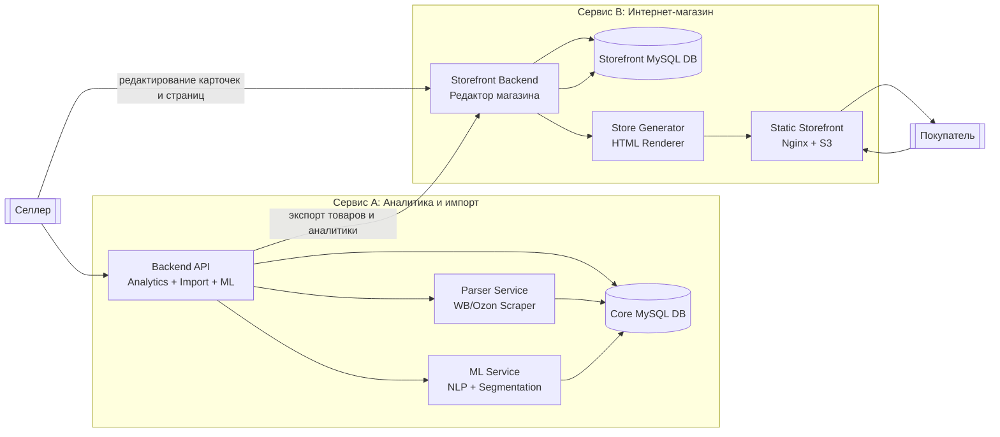
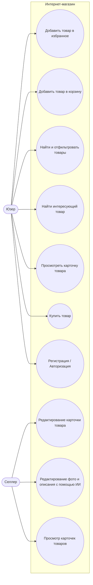
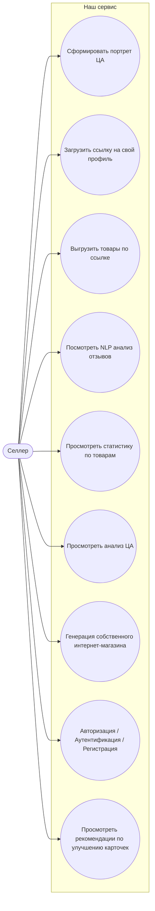
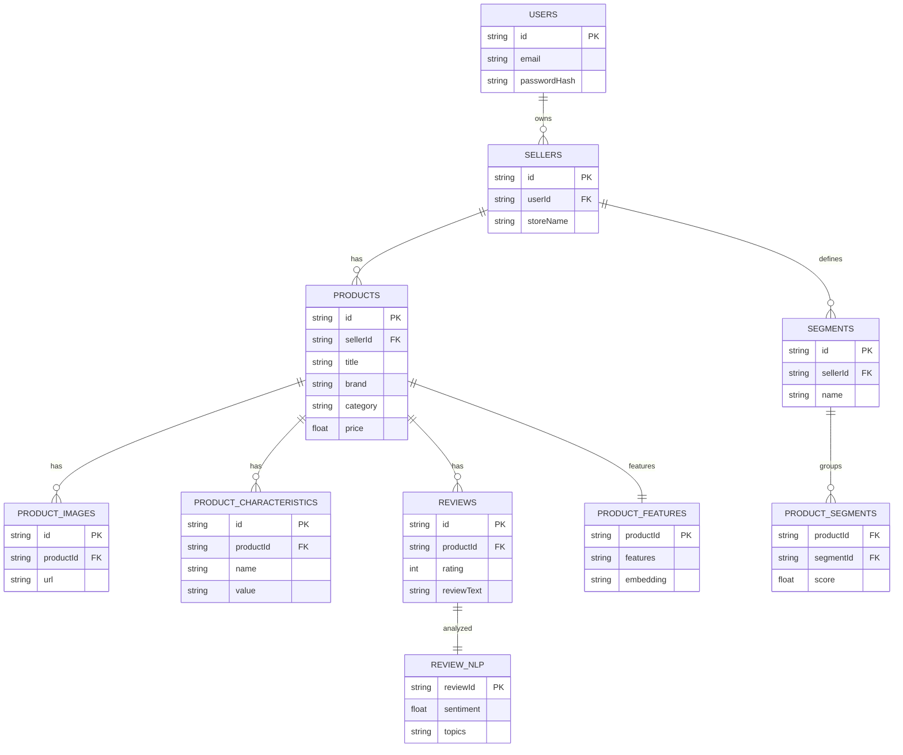
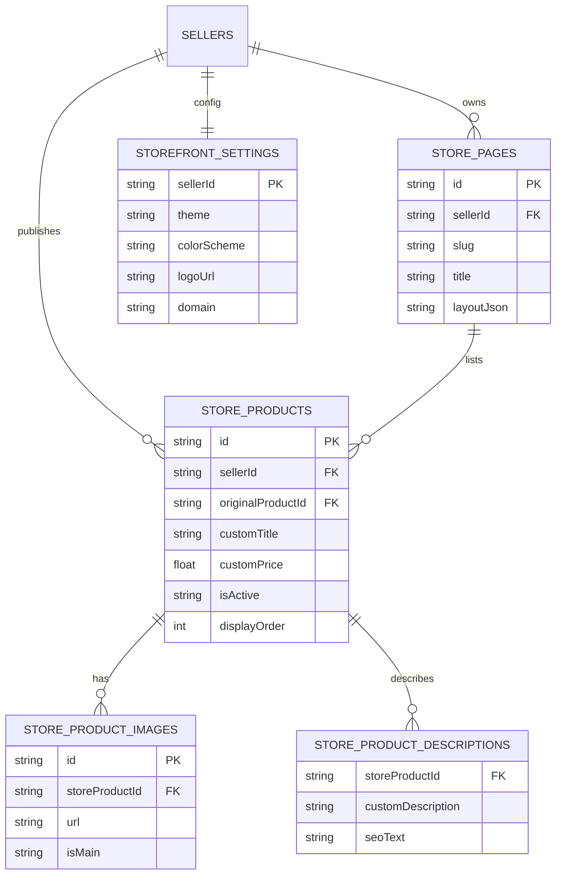

## Описание MVP
MVP представляет собой сервис для селлеров маркетплейсов, который по ссылке на профиль продавца автоматически импортирует товары, анализирует отзывы с помощью ML, формирует портрет целевой аудитории и генерирует персональный интернет-магазин.

---

## Основные функции MVP

### 1. Импорт товаров по ссылке
Селлер загружает ссылку на свой профиль в Wildberries или Ozon.  
Система автоматически:
- парсит товары,
- выгружает фотографии и характеристики,
- собирает и структурирует отзывы,
- сохраняет данные в MySQL.

---

### 2. NLP-анализ отзывов
ML-модуль выполняет:
- sentiment analysis (тональность),
- topic modeling (ключевые темы),
- выделение триггеров и барьеров покупателей.

Результатом является отчёт: что нравится покупателям и что мешает покупке.

---

### 3. Формирование портрета целевой аудитории (ЦА)
На основе отзывов, характеристик товаров и поведения пользователей сервис определяет:
- ключевые сегменты ЦА,
- мотивации покупателей,
- барьеры и сомнения,
- триггеры, влияющие на решение о покупке.

---

### 4. Рекомендации по улучшению карточек товаров
Система автоматически предлагает:
- улучшения в описании,
- идеи для новых фотографий,
- улучшения характеристик,
- факторы, повышающие конверсию.

---

### 5. Генерация персонального интернет-магазина
Система создает статический сайт, который включает:
- карточки товаров,
- автоматически улучшенные описания,
- рекомендации для покупателей,
- целевую структуру, оптимизированную под сегменты ЦА.

Сайт рендерится автоматически и используется как внешняя витрина продавца.

---

# Целевая аудитория (ЦА)

# Краткое резюме ЦА
Наш сервис нужен всем селлерам, которым важно:
- понять свою аудиторию,
- улучшить карточки товаров,
- анализировать отзывы автоматически,
- быстро создавать собственную витрину,
- увеличивать продажи.

# User Stories для двух сервисов (Сервис 1 и Сервис 2)

## СЕРВИС 1

## User Story 1. Авторизация / регистрация
Как селлер
я хочу зарегистрироваться и авторизоваться в сервисе,  
чтобы получить доступ к аналитике и инструментам.

## User Story 2. Загрузить ссылку на свой профиль
Как селлер  
я хочу загрузить ссылку на свой магазин на Wildberries/Ozon,  
чтобы сервис смог автоматически импортировать мои товары.

## User Story 3. Выгрузить товары по ссылке
Как селлер  
я хочу, чтобы система автоматически выгрузила товары по ссылке,  
чтобы мне не пришлось переносить карточки вручную.

## User Story 4. Просмотреть NLP анализ отзывов
Как селлер  
я хочу просматривать анализ отзывов на товары,  
чтобы понимать, что нравится и не нравится покупателям.

## User Story 5. Сформировать портрет целевой аудитории
Как селлер  
я хочу получить автоматически сформированный портрет ЦА,  
чтобы понимать, кто является моим покупателем и зачем он делает покупку.

## User Story 6. Просмотреть анализ ЦА
Как селлер  
я хочу видеть сегменты аудитории, их мотивации, барьеры и триггеры,  
чтобы оптимизировать карточки под реальных покупателей.

## User Story 7. Просмотреть рекомендации по улучшению карточки товара
Как селлер  
я хочу получать рекомендации по улучшению фото, описания и характеристик,  
чтобы повышать конверсию моего товара.

## User Story 8. Генерация собственного интернет-магазина
Как селлер  
я хочу сгенерировать собственный интернет-магазин,  
чтобы размещать свои товары вне маркетплейсов и привлекать трафик.

## User Story 9. Просмотреть статистику по товарам
Как селлер  
я хочу видеть статистику по товарам (динамику рейтинга, негатива, характеристик),  
чтобы отслеживать эффективность и вовремя видеть проблемы.

### Итоговые эпики 

Импорт данных: загрузка ссылки, выгрузка товаров  
Аналитика: анализ отзывов, статистика товаров  
ML: портрет ЦА, сегменты ЦА  
Рекомендации: улучшение карточки  
Генерация магазина: создание собственной витрины  
Управление доступом: авторизация

## СЕРВИС 2 - Интернет-магазин (витрина для покупателей)

## User Story 1. Найти интересующий товар
Как покупатель  
я хочу находить интересующие товары,  
чтобы быстро подобрать нужный продукт.

## User Story 2. Просмотреть карточку товара
Как покупатель  
я хочу открывать карточку товара,  
чтобы увидеть фотографии, описание и характеристики.

## User Story 3. Добавить товар в избранное
Как покупатель  
я хочу добавлять товары в избранное,  
чтобы вернуться к ним позже.

## User Story 4. Добавить товар в корзину
Как покупатель  
я хочу добавить товар в корзину,  
чтобы оформить заказ позже.

## User Story 5. Найти и отфильтровать товары
Как покупатель  
я хочу фильтровать товары по цене, категории и параметрам,  
чтобы быстрее находить нужный вариант.

## User Story 6. Купить товар
Как покупатель  
я хочу перейти на карточку товара на Wildberries/Ozon,  
чтобы оформить покупку на привычной платформе.

## User Story 7. Редактировать карточки товара (для селлера)
Как селлер  
я хочу редактировать описания, фотографии и текст карточек магазина с помощью ии,  
чтобы витрина выглядела корректно и профессионально.

## User Story 8. Просматривать карточки товаров в витрине (для селлера)
Как селлер  
я хочу видеть, как мои товары отображаются покупателям,  
чтобы убедиться в корректности генерации магазина.

**Итоговые эпики** 
Покупательские функции: поиск, просмотр товара, избранное, корзина, покупка, фильтры  
Управление витриной (селлер): просмотр карточек, редактирование

## Схема архитектуры

### Use case диаграммы

### Use case диаграмма для нашего сервиса 

## ER-диаграмма

### Диаграмма №2 - STOREFRONT DATABASE (интернет-магазин + редактирование селлером)

